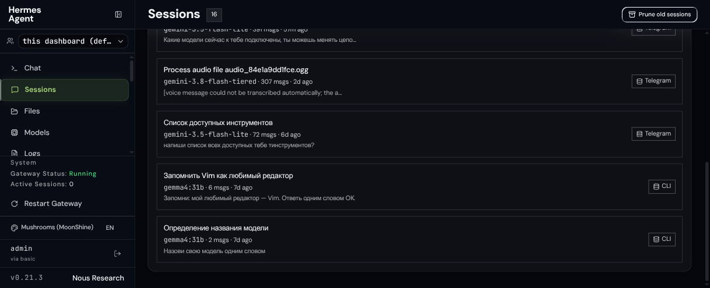
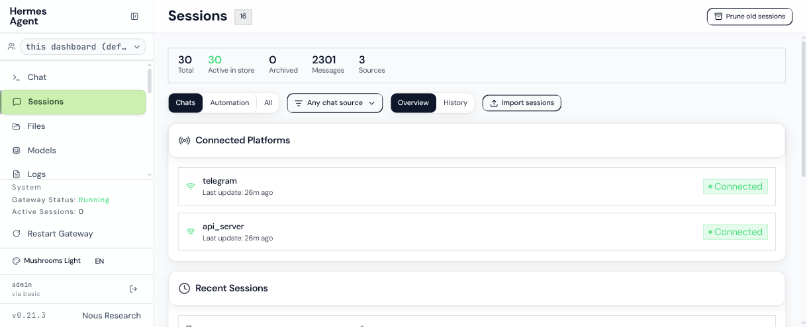

# Hermes Dashboard Themes

A collection of modern, clean, and elegant themes for the [Nous Research Hermes Agent](https://github.com/NousResearch/hermes-agent) WebUI (`hermes dashboard`).

Inspired by the design aesthetics of [MoonShine Mushrooms Theme](https://github.com/tikhomirov/moonshine-mushrooms-theme) and [Laravel Filament](https://filamentphp.com/).

[](LICENSE)
[](https://github.com/NousResearch/hermes-agent)

---

## Previews

### Mushrooms Dark
A deep dark canvas with fresh lime accents and subtle glassmorphic panels.



### Mushrooms Light
A crisp, clean light mode with soft shadows and pastel lime badges.



---

## Why These Themes?

The default Hermes Agent dashboard ships with a retro-futuristic, terminal-inspired design using wide stretched typography (`Rules Expanded`), bitmap pixel fonts (`Mondwest`), and high-contrast terminal styling.

These themes bring a refined, contemporary look:
- **Modern Typography:** Replaces sci-fi retro fonts with clean, geometric **DM Sans** for all UI elements, headings, and cards, paired with **JetBrains Mono** for code and data readouts.
- **Glassmorphism Panels:** Translucent card surfaces with refined borders, delicate shadows, and subtle ambient radial glow.
- **Modern Navigation & Badges:** Rounded pills, clean active-state indicators, and compact sidebar styling.
- **Dark & Light Modes:** Both palettes are tuned for daily work with balanced contrast and reduced eye strain.

---

## Included Themes

| Theme | File | Description |
|---|---|---|
| **Mushrooms (MoonShine)** | `themes/mushrooms.yaml` | Dark canvas (`#05070d`), subtle lime accents (`#a8d879`), glassmorphic panels |
| **Mushrooms Light** | `themes/mushrooms-light.yaml` | Clean light canvas (`#f8fafc`), crisp white cards, slate text (`#0f172a`), pastel lime (`#cbf0b0`) |
| **Filament (Amber)** | `themes/filament.yaml` | Dark slate canvas (`#090d16`) with signature warm amber accents (`#f59e0b`) |

---

## Installation

### Method 1: Local / CLI Installation

Copy the theme files into your user's Hermes dashboard themes directory:

```bash
mkdir -p ~/.hermes/dashboard-themes
cp themes/*.yaml ~/.hermes/dashboard-themes/
```

### Method 2: Docker / Home Server Deployment

If running Hermes Agent via Docker Compose (e.g. `/opt/stacks/hermes`):

```bash
# Copy into the mounted data directory
cp themes/*.yaml /path/to/hermes/data/dashboard-themes/
```

> **Note:** No container restart is required. Hermes dynamically discovers YAML files in `dashboard-themes/` on the fly.

---

## How to Switch Themes

### In the Web UI
1. Open the Hermes WebUI dashboard in your browser.
2. In the bottom-left corner of the sidebar, click the **Palette** icon (Theme Switcher).
3. Select **Mushrooms (MoonShine)**, **Mushrooms Light**, or **Filament (Amber)**.

### Via API
You can also change the active theme via the REST API:

```bash
# Switch to Mushrooms Dark
curl -X PUT http://localhost:9119/api/dashboard/theme \
  -H "Content-Type: application/json" \
  -d '{"name":"mushrooms"}'

# Switch to Mushrooms Light
curl -X PUT http://localhost:9119/api/dashboard/theme \
  -H "Content-Type: application/json" \
  -d '{"name":"mushrooms-light"}'
```

---

## License

This project is licensed under the MIT License — see the [LICENSE](LICENSE) file for details.
